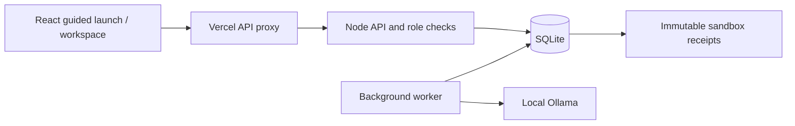

# Architecture

Local development omits the Vercel hop. Vite proxies `/api` to the same Node service.

## One state model, two views

The guided flow narrows the first visit to one course and four steps. The full workspace exposes the same documents, version checks and actions rather than maintaining a second simulation. Browser-local unsaved drafts preserve their original server revision for conflict resolution.

## AI is a proposal producer

A run captures the relevant documents and confirmed source context. The adapter requests only the chosen fields and validates the returned structure and bounded factual claims. A repeated headline gets one correction attempt, not endless retries. Applying a proposal remains a separate operator action. A small local model can still fail or produce weak writing; the interface must say so honestly.

## Approval and delivery

A candidate freezes all four document variants, the recipient bindings, relevant source/rule versions and its dispatch plan. Message-review acknowledgments reference that frozen copy. Approval is role-enforced and requires all checks for new candidates. The delivery worker claims a fenced lease and stores a unique receipt for each recipient/channel pair. Cancelling cannot recall already-committed messages.

## Deployment boundary

The Vercel function is a stateless proxy, not the job runner or database. Its backend origin is deployment configuration rather than a hard-coded personal hostname. It accepts only the app's API routes, checks incoming origin, preserves multipart bytes and cookies, and returns clear errors when the backend is unavailable. App requests enqueue generation; the long-running inference does not occupy a Vercel request.

The backend needs persistent storage and uptime. This separation permits moving it from a development host to a server without changing the frontend contract. Server restarts requeue interrupted model attempts with a new attempt fence. Only one model request runs per worker at a time.
